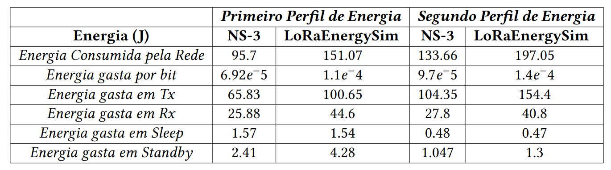

# NS-3 x LoRaEnergySim
Avaliação comparativa dos módulos de energia dos simuladores NS-3 e LoRaEnergySim.

## Objetivo

Investigar o cálculo aplicado por cada simulador para descobrir o total de energia gasta pela rede, usando os mesmos parâmetros em ambos

## Cenário Simulado
- Cenário de tamanho 100x100
- 1 dispositivo localizado em (100,0,0) enviando 10 bytes a cada 5s numa transmissão uplink prum gateway em (0,0,0);
- Largura de banda de 125 Hz e frequência de 868 MHz (espectro europeu);
- Modelo de propagação usado foi o LogDistance, adaptado para o LES conforme:  [Modelo de Propagação](https://www.notion.so/LoRaEnergySim-LES-21cbd759861d8041b40bd33e2827c84a?pvs=21);
- Mensagens do tipo confirmadas;
- Duração de 24h, baseado no [exemplo](https://github.com/signetlabdei/lorawan/blob/develop/examples/lorawan-energy-model-example.cc) do módulo lorawan do NS-3;
- Dois perfis de consumo de energia;

## Implementações Realizadas
### NS-3

- Criação do **modelo de propagação** (*Log Shadow Model*) para simular uma variável de shadowing no cenário do canal;
- Implementação da **obtenção das métricas de consumo de energia por estado do dispositivo;**
- Inclusão funções de tracing **para envio e recepção de mensagens**, facilitando depuração e análise do comportamento do nó;

### LoRaEnergySim
- Ajuste nos **delays iniciais**, especialmente nas funções de **sleep** de Node.py;
- Possibilidade de simular dois grupos de dispositivos com configurações diferentes (Multi aplicações);
- Modificação na **atribuição do Spreading Factor (SF)**, que era **aleatória** por padrão;
- Inclusão de **logs para entrada e saída de funções**, facilitando depuração e análise do comportamento do nó;


## Resultados

- LoRaEnergySim calcula um consumo maior no estado de transmissão (Tx) do que o NS-3;



## Diretórios

### Pasta ```NS-3```
Contém a biblioteca LoRaWAN com as modificações realizadas. O código do nosso cenário de comparação está em `lorawan-energy-model-example.cc`.

### Pasta ```LoRaEnergySim``` 
Contém o simulador completo com a pasta `Simulations/teste`, contendo o cenário testado.  
